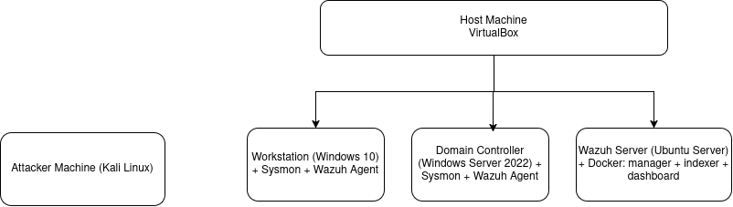
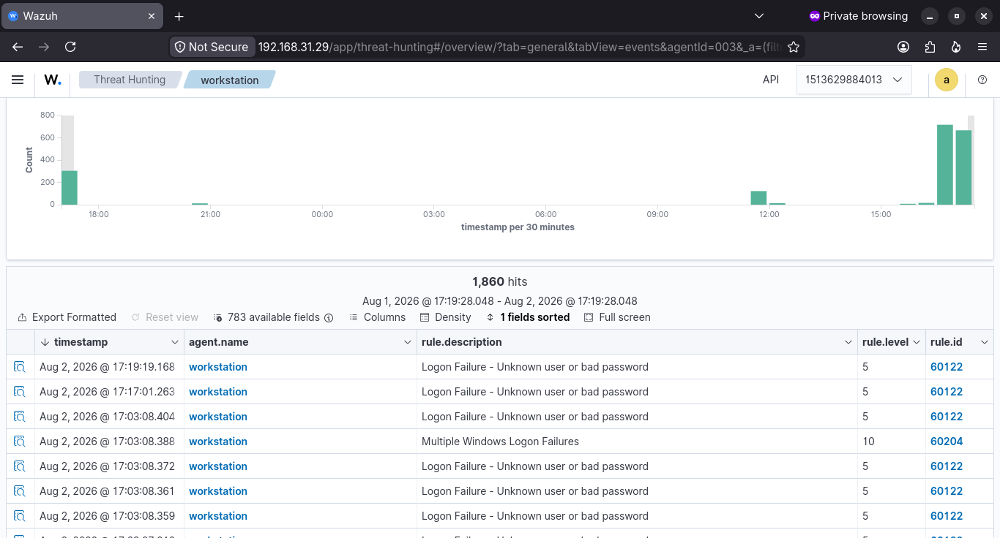
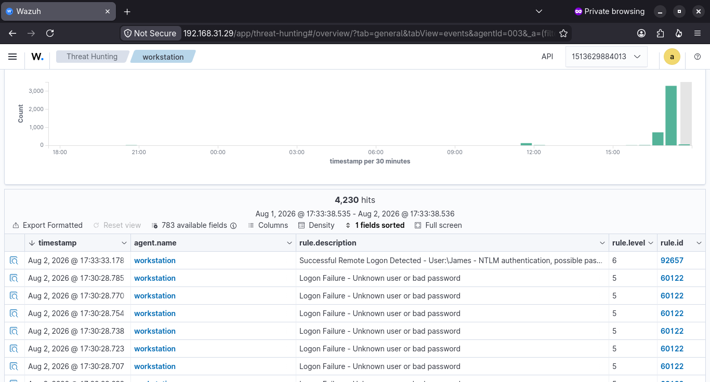

# Detection Engineering Lab

**AD + Wazuh SIEM lab testing real attacks against default detection rules — documenting what's caught, what's missed, and the fixes applied.**

`wazuh` `siem` `detection-engineering` `active-directory` `mitre-attack` `blue-team` `purple-team`

---

## What this is

Most "I deployed a SIEM" projects end at a dashboard screenshot. This one is built around one question, asked separately for every attack technique run against the lab:

**Did the SIEM actually catch it — and if the classification was wrong, why?**

The environment: a Windows Server 2022 **Domain Controller**, a domain-joined Windows 10 **Workstation**, a Dockerized **Wazuh** SIEM stack, and a **Kali** attacker box on a separate physical machine, attacking over a deliberately pivot-required network layout (attacker → workstation → DC).

📐 **[Full architecture & setup, including every problem hit along the way →](./docs/architecture-and-setup.md)**



---

## Result: Scenario 1 — SMB Brute Force

*(Full write-up with all screenshots and raw event detail: **[docs/scenarios/scenario-01-brute-force.md](./docs/scenarios/scenario-01-brute-force.md)**)*

**Setup:** `netexec` ran a credential-guessing attack over SMB against the workstation (`10.0.2.6`) using a local test account and `rockyou.txt`.

**What Wazuh caught:**

| Layer | Result |
|---|---|
| Individual failed logons | ✅ Rule `60122` fired per attempt — ~1,800+ events captured |
| Correlated attack pattern | ✅ Rule `60204` – *"Multiple Windows Logon Failures"* (level 10) — a real correlated alert, not just raw logs |
| Successful logon | ⚠️ Detected, but **mislabeled** — see finding below |



**The finding worth noting:** the eventual successful logon was flagged by Wazuh's default ruleset as *"possible pass-the-hash attack"* and *"possible RDP connection."* Neither was true — it was a plain NTLM/SMB logon from `netexec`. The rule fires on **any** NTLM network logon rather than on indicators actually specific to pass-the-hash or RDP. In a real environment, this rule as shipped would generate false "possible PtH" alerts on ordinary admin tooling and service accounts — a genuine alert-fatigue risk, and a concrete tuning target.

**Verdict:** ✅ Detected at both the raw and correlated level. ⚠️ Successful-logon classification needs tuning before it'd be production-trustworthy.



**Update — Active Response attempted:** wired Wazuh's Active Response module to auto-block the attacker IP on detection. Execution triggered correctly on every alert, but the firewall rule was never actually created — traced to a payload-parsing limitation in Wazuh's shipped Windows AR script when handling large, nested eventchannel alerts. Full root-cause writeup: [scenario-01-brute-force.md#update-active-response-automated-containment--attempted](./docs/scenarios/scenario-01-brute-force.md#update-active-response-automated-containment--attempted).

---

## Result: Scenario 2 — Password Spray Across Multiple Accounts + Persistence Attempt

*(Full write-up: **[docs/scenarios/scenario-02-password-spray.md](./docs/scenarios/scenario-02-password-spray.md)**)*

**Setup:** a single-password spray via `netexec` against three domain accounts (`James`, `Daniel`, `Alisha`) targeting the workstation only — the Domain Controller sits behind a pivot boundary and was not directly reachable, by design.

**What happened:**

| Tier | Accounts | Result |
|---|---|---|
| Confirmed compromised | `Alisha` | ✅ Successful NTLM logon detected (rule `92652`) |
| Targeted, not breached | `James`, `Daniel` | ✅ Failed logons detected (rule `60122`/`100010`) |

**Post-compromise:** attempted to establish persistence on the compromised account via a remote scheduled task (Impacket `atexec`). Rejected with `rpc_s_access_denied` — `Alisha` had valid credentials but no local admin rights on the target, so the attack chain stopped at the privilege boundary, not the detection layer.

**The finding worth noting:** the *rejected* persistence attempt generated no distinct Wazuh-visible telemetry of its own — a SOC would see the successful logon, but nothing showing what the attacker tried next unless task-scheduler-specific auditing is separately enabled. A real, if narrow, visibility gap.

**Verdict:** ✅ Spray and scoping fully detected across all three accounts. ✅ Privilege boundary held (real control, working as intended). ⚠️ Detection gap identified in visibility into rejected persistence attempts.

---

---
 
## Result: Scenario 3 — Phishing Email Analysis (Static Triage)
 
*(Full write-up: **[docs/scenarios/scenario-03-phishing-email-analysis.md](./docs/scenarios/scenario-03-phishing-email-analysis.md)**)*
 
A departure from the lab-attack format above: this scenario is **cold analyst triage of a real-world phishing sample** (via PhishingPot), not an attack executed against the lab's own infrastructure. Same investigative discipline applied — extract, verify independently, reach a documented verdict.
 
**Sample:** a fake Microsoft "unusual sign-in activity" alert, spoofing three unrelated domains across the display name, From address, and envelope/HELO domain in a single message.
 
**Key findings:**
 
| Check | Result |
|---|---|
| SPF / DKIM / DMARC | ❌ All three failed or errored — should never have reached an inbox |
| Sender IP & envelope domain (VirusTotal) | Clean (0/91, 0/98) |
| Tracking-pixel domain (VirusTotal) | **10-11/92 vendors flagged malicious/phishing** |
| Domain lifecycle (WHOIS) | 23 IP changes across 3 years — disposable, rapidly-cycled infrastructure |
 
**The finding worth noting:** the sending infrastructure looked clean on reputation checks — the actual flagged-malicious infrastructure was a hidden 1×1 tracking pixel, not the delivery path itself. Checking only sender IP/domain reputation would have under-classified this email. The message also embeds several hundred lines of random multilingual "word salad" text purely to dilute spam-filter scoring — a filter-evasion technique distinct from anything seen in Scenarios 1-2.
 
**Verdict:** ✅ Confirmed phishing, corroborated by multiple independent sources, no single indicator treated as sufficient alone.
 
---


## MITRE ATT&CK Coverage

| Technique | ID | Verdict |
|---|---|---|
| Brute Force | T1110 | ✅ Detected (raw + correlated alert) |
| Domain Account Auth (NTLM) | T1078.002 | ⚠️ Detected but over-classified as PtH/RDP |
| Password Spraying | T1110.003 | ✅ Detected across all targeted accounts |
| Scheduled Task/Job (attempted) | T1053.005 | ❌ Blocked by privilege boundary; no distinct detection telemetry for the attempt itself |

📊 **[Full coverage rollup and methodology notes →](./docs/mitre-coverage.md)**

*(This table only lists techniques actually executed — it's a record, not a roadmap.)*

---

## Tech Stack

| Component | Choice |
|---|---|
| Hypervisor | Oracle VirtualBox (NAT Network + bridged pivot boundary) |
| SIEM | Wazuh 4.14.x — Docker single-node (manager + indexer + dashboard) |
| Endpoint telemetry | Windows Event Logs + Sysmon (SwiftOnSecurity config) |
| Domain environment | Windows Server 2022 (AD DS, DNS) + Windows 10 workstation |
| Attacker tooling | Kali Linux, `netexec` |

---

## A Few Lessons From Building This

The setup process surfaced as many real problems as the attacks did — full detail in [architecture-and-setup.md](./docs/architecture-and-setup.md#problems-faced-during-setup), highlights:

- Ubuntu Server's installer doesn't allocate full disk to the root LV by default — a "30GB" VM can silently run on 14GB until `lvextend` fixes it.
- VirtualBox's **NAT** and **NAT Network** modes are not interchangeable — plain NAT isolates each VM into its own private network, even if subnets happen to overlap.
- "No internet" can mean routing, DNS, or missing DNS forwarders — three different fixes, and `ping <ip>` vs `ping <name>` is the fastest way to tell which.
- When repeated `dpkg` state corruption kept blocking a clean Wazuh install, switching to the official Docker deployment resolved an entire *class* of problems rather than patching them one at a time.

---

## Repository Structure

```
.
├── README.md                          — you are here
├── docs/
│   ├── architecture-and-setup.md      — diagram, setup steps, every problem + fix, lessons learned
│   ├── mitre-coverage.md              — full technique-to-detection rollup
│   ├── architecture.svg
│   ├── screenshots/
│   └── scenarios/
│       ├── scenario-01-brute-force.md      — attack + detection + active-response containment attempt
│       └── scenario-02-password-spray.md   — multi-account spray, scoping, persistence attempt
```

---

## Future Work

Infrastructure additions planned — **not** attacks (those only get added above once actually executed):

- [ ] WebGoat (Dockerized) as a dedicated vulnerable web target, to extend coverage into web attack techniques
- [ ] Published MITRE ATT&CK Navigator layer for a visual coverage heat-map
- [ ] Task-scheduler / "Other Object Access Events" auditing to close the persistence-attempt visibility gap found in Scenario 2

---

## Author

**Dev Shishodia** — [GitHub](https://github.com/d3v-sh) · [LinkedIn](https://linkedin.com/in/devshishodia)