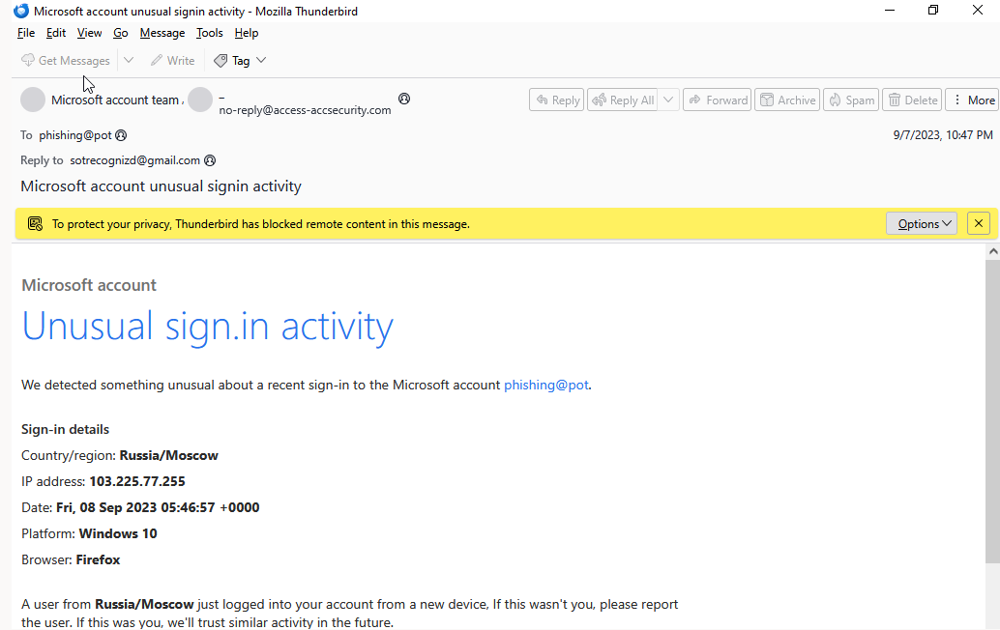
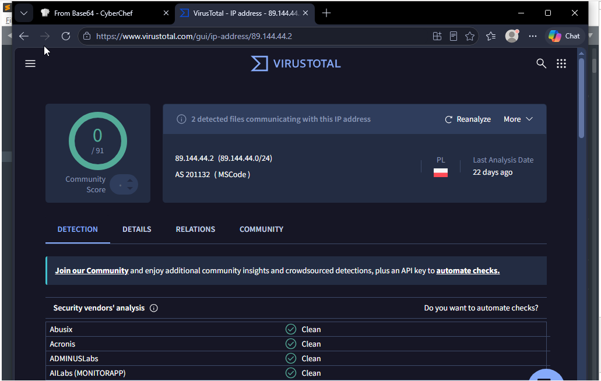
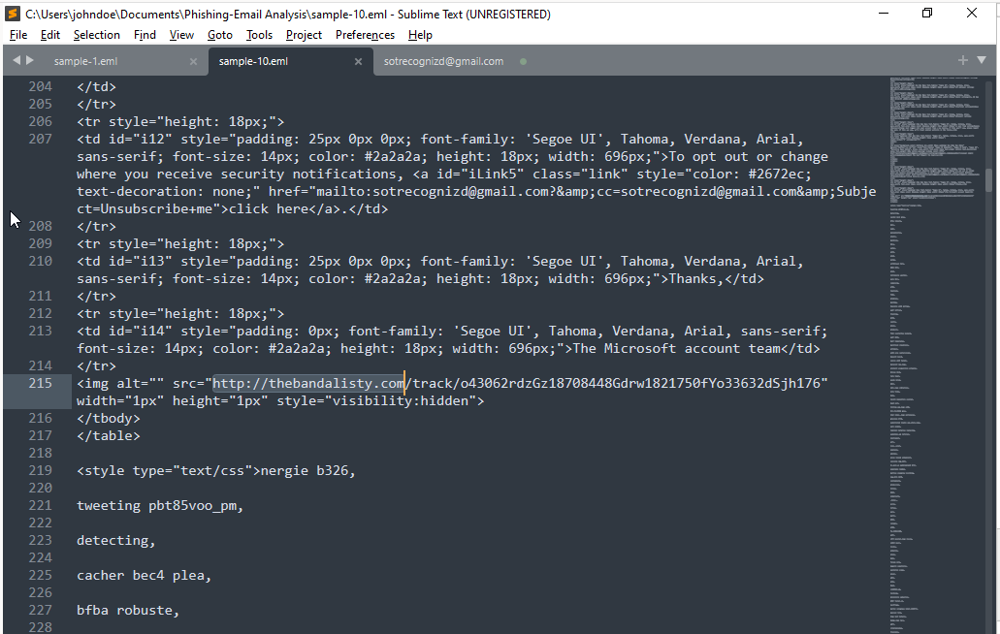
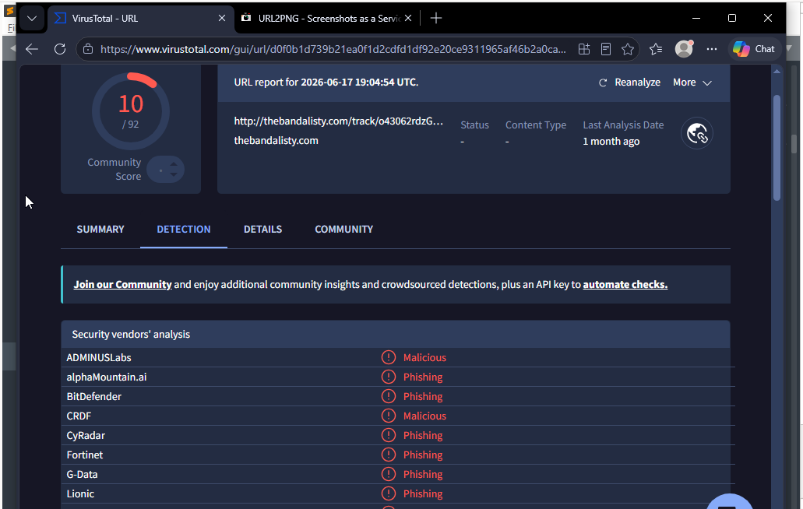
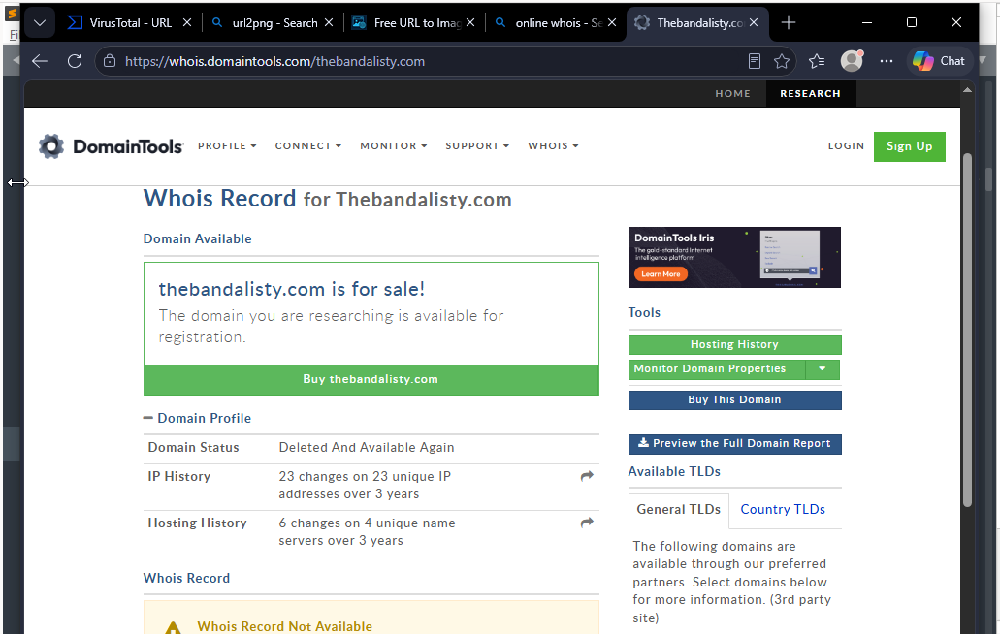

# Scenario 3: Phishing Email Analysis — Fake Microsoft Sign-In Alert

[← Back to README](../../README.md) · [MITRE Coverage](../mitre-coverage.md)

| | |
|---|---|
| **MITRE ATT&CK Technique** | T1566.002 (Phishing: Spearphishing Link), T1585 (Establish Accounts — Reply-To harvesting) |
| **Sample source** | PhishingPot repository, sample `sample-10.eml` |
| **Analysis type** | Static/offline triage — no attack executed against lab infrastructure |
| **Verdict** | ✅ Confirmed phishing — impersonation, header spoofing, tracking pixel, credential-harvest reply funnel, all independently verified |

---

## Objective

Practice cold triage of a real-world phishing sample the way an analyst would receive one via a user report or spam-filter escalation: extract every artifact from raw headers and body, verify each one against independent sources (VirusTotal, WHOIS), and reach a documented verdict — without assuming malicious intent up front, the same discipline applied in Scenarios 1 and 2.

## Sample Overview

The email impersonates a Microsoft "unusual sign-in activity" security alert, designed to panic a recipient into believing their Microsoft account was accessed from Russia, and drive them to reply/click.

📸 `docs/screenshots/scenario-03-raw-email.png` — the rendered email as received (Thunderbird view)


## Header Analysis

Extracted directly from the raw `.eml` source (`Authentication-Results`, `Received`, `Received-SPF`):

| Field | Value | Note |
|---|---|---|
| From (display) | `Microsoft account team` | Spoofed display name |
| From (actual address) | `no-reply@access-accsecurity.com` | Lookalike domain — *not* a Microsoft domain |
| Sender's real IP | `89.144.44.2` | Confirmed via `Received:` chain |
| HELO/envelope domain | `thcultarfdes.co.uk` | Unrelated to both the display name and the From address — three different domains in one message |
| Return-Path | `bounce@thcultarfdes.co.uk` | Bounce handling routed to attacker infra, not Microsoft |
| Reply-To | `sotrecognizd@gmail.com` | Free-mail harvesting address — replies (e.g., "Report the user") go straight to the attacker |
| To | `phishing@pot` | PhishingPot sample placeholder recipient |
| Date | Fri, 08 Sep 2023 05:47:04 +0000 | |
| **SPF** | **`none`** — sender IP not authorized by `thcultarfdes.co.uk` | Fail |
| **DKIM** | **`none`** — message not signed | Fail |
| **DMARC** | **`permerror`** | Fail/inconclusive — no enforceable policy honored |
| Spam Confidence Level (Microsoft) | `SCL:5` | Flagged as likely spam by the receiving Exchange tenant itself |

**All three authentication mechanisms (SPF, DKIM, DMARC) failed or errored** — a message this poorly authenticated should not have reached an inbox in an environment with reasonably strict mail-flow rules; its `SCL:5` rating confirms Microsoft's own filtering was already suspicious of it.

## Body & Content Analysis

- **Bait content:** the email body claims a sign-in from **Russia/Moscow, IP `103.225.77.255`**, Windows 10, Firefox. This IP appears **only in the crafted HTML body text** — it is unrelated to the actual sending infrastructure (`89.144.44.2`) and was never independently verified as a real endpoint; it exists purely to make the lure specific and alarming.
- **Credential/response funnel:** both the "click here to report" link and the "Report the User" button are `mailto:` links pointing to `sotrecognizd@gmail.com` — rather than harvesting a password via a fake login page, this variant harvests **engagement and confirms the mailbox is live** by inviting a reply.
- **Hidden tracking pixel:** a 1×1 invisible image (`visibility:hidden`) pointed at:
  ```
  http://thebandalisty.com/track/o43062rdzGz18708448Gdrw1821750fYo33632dSjh176
  ```
  This confirms open/view tracking — the attacker knows the moment the email is opened, independent of any click.
- **Bayesian filter evasion:** the message ends with several hundred lines of random, disconnected multilingual words (`nergie`, `tweeting`, `cacher bec4 plea`, `protonmail utiliza`, etc.) hidden in a `<style>` block. This is a known technique — padding a message with high-entropy, benign-looking text to dilute spam-filter word-frequency scoring. It has no display purpose; it exists solely to make the message look more "normal" to statistical spam classifiers.

## Independent Verification

| Indicator | Source checked | Result |
|---|---|---|
| Sender IP `89.144.44.2` | VirusTotal | 0/91 flagged — clean at time of check (likely short-lived/low-reputation sending infra rather than a long-tracked malicious host) |
| `thcultarfdes.co.uk` (envelope/HELO domain) | VirusTotal | 0/98 flagged at time of check |
| `thebandalisty.com` (tracking pixel domain) | VirusTotal | **10-11/92 vendors flagged malicious/phishing** (BitDefender, Fortinet, G-Data, CRDF, CyRadar, Lionic, alphaMountain.ai, ADMINUSLabs, Chong Lua Dao, and others) |
| `thebandalisty.com` | WHOIS (DomainTools) | Domain **deleted and available again** — 23 IP changes across 23 unique addresses and 6 hosting changes in 3 years, consistent with disposable, rapidly-cycled attacker infrastructure rather than a legitimate long-standing domain |

📸 `docs/screenshots/scenario-03-vt-sender-ip-clean.png` — VirusTotal result for sender IP `89.144.44.2`, showing 0/91 detections


📸 docs/screenshots/scenario-03-hidden-tracking-link-source.png — raw .eml source in Sublime Text showing the hidden 1×1 tracking pixel (visibility:hidden) and its embedded URL pointing to thebandalisty.com/track/...


📸 `docs/screenshots/scenario-03-vt-tracking-domain-malicious.png` — VirusTotal result for `thebandalisty.com`, showing 10+/92 malicious/phishing detections — the contrast with the sender IP result above is the key point of this finding


📸 `docs/screenshots/scenario-03-whois-domain-lifecycle.png` — WHOIS record showing the domain's disposable/rapidly-cycled hosting history


**Key finding from verification:** the sending IP and envelope domain showed as clean, while the *tracking pixel domain* was clearly and independently flagged as malicious by multiple vendors. This is a useful lesson in scope: checking only the sender's IP/domain would have under-classified this email — the actual malicious infrastructure was the secondary tracking link, not the delivery path.

## Indicators of Compromise (IOCs)

| Type | Value |
|---|---|
| From address (spoofed) | `no-reply@access-accsecurity.com` |
| Envelope/HELO domain | `thcultarfdes.co.uk` |
| Sender IP | `89.144.44.2` |
| Reply-To (harvesting address) | `sotrecognizd@gmail.com` |
| Tracking pixel domain | `thebandalisty.com` |
| Tracking pixel full URL | `http://thebandalisty.com/track/o43062rdzGz18708448Gdrw1821750fYo33632dSjh176` |
| Bait IP (crafted lure content, not real infra) | `103.225.77.255` |

## MITRE ATT&CK Mapping

| Technique | ID | Tactic | Evidence |
|---|---|---|---|
| Spearphishing Link | T1566.002 | Initial Access | Tracking-pixel link and reply-to funnel disguised as a legitimate security notification |
| Establish Accounts / Impersonation | T1585.001 (adjacent) | Resource Development | Free-mail Reply-To harvesting address distinct from any spoofed identity |

## Verdict

✅ **Confirmed phishing.** Every independent check corroborated the initial read: failed sender authentication across all three mechanisms, a display/From/envelope domain mismatch (three unrelated domains in one message), a tracking pixel resolving to infrastructure independently flagged as malicious by 10+ vendors, and a deliberate spam-filter-evasion technique (word-salad padding) embedded in the message. No single indicator was treated as sufficient on its own — the verdict rests on the combination.

## Recommendations

- SPF/DKIM/DMARC enforcement (not just monitoring) at the mail gateway would have blocked this message outright — `dmarc=permerror` with no enforced policy is a gap worth flagging to any real organization's mail admin.
- User training should specifically call out the "reply to report" pattern used here — it's a lower-friction, higher-success variant of classic credential phishing, since it asks for engagement rather than a password, and feels less obviously dangerous to a wary user.
- Tracking-pixel domains should be treated as first-class IOCs, not secondary details — in this sample, the sending infrastructure looked clean while the actual flagged-malicious infrastructure was the pixel's destination.

---

[← Back to README](../../README.md) · [MITRE Coverage](../mitre-coverage.md)